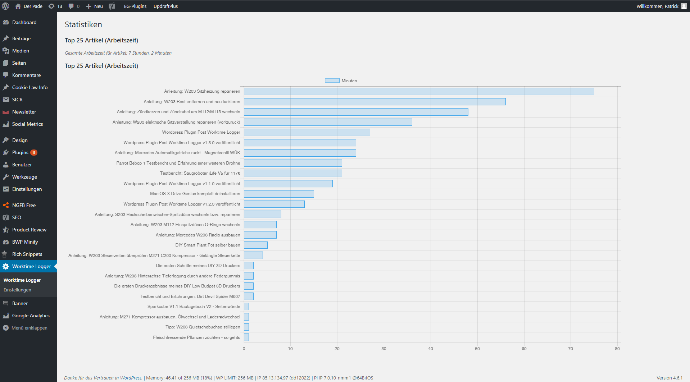

[](https://www.codacy.com/app/patrick-hausmann/post-worktime-logger?utm_source=github.com&amp;utm_medium=referral&amp;utm_content=blackus3r/post-worktime-logger&amp;utm_campaign=Badge_Grade)
[](http://isitmaintained.com/project/blackus3r/post-worktime-logger "Average time to resolve an issue")
[](http://isitmaintained.com/project/blackus3r/post-worktime-logger "Percentage of issues still open")
[](https://www.paypal.com/cgi-bin/webscr?cmd=_s-xclick&hosted_button_id=28WZAXQDXYZ5A)

# Post Worktime Logger

Post Worktime Logger is a WordPress plugin that allows you to track the time you worked on each post.

You can find more information here. https://wordpress.org/plugins/post-worktime-logger/.

German changelog and tutorials of ths plugin can be found on [DerPade](http://www.derpade.de/series/post-worktime-logger/).

## What does it do?

Post Worktime Logger will tell you how much time did you spend in a WordPress post. It will only count the time if you are actively working in the post, so don't worry if you have to leave the computer alone!

## Installation

1. Clone this repository and switch to the branch you want to use.
2. Upload /post-worktime-logger/ to the /wp-content/plugins/ directory in your WordPress blog.
3. Activate the plugin through the 'Plugins' menu in WordPress.

## Usage

Post Worktime Logger will start to track the time you spend in each post automatically as soon as you install it. You'll find the time in various places, such as the meta box when you're editing a page, or the posts list.

In the plugin settings you can edit the title of the plugin, and enable or disable if you want to let non-logged users to see it.

## Screenshots

### Edit Post

Post Worktime Logger will add a new interactive box to your edit screen, allowing you to keep track of how much time you spend on your alterations:


You may stop the current counting whenever you need to do something else, or reset it altogether, for example, if you want to restart your work from scratch.

### Post List

The plugin changes your post list, granting you an additional column that shows the time spent on any particular post:


### Statistics

The plugin also offers an indicator that allows you to know which articles you spent more time working on. To check it, just go to your dashboard, it will be the first option under the plugin entry in the sidebar:



### Plugin Widget

Post Worktime Logger will let you add a configurable widget to your site, similar to the meta box on the Edit Post screen:


You are able to choose its display name, and whether the widget will be exposed or not to non-logged visitors.

## Suggest new features

There is a missing feature? Please create an issue for that.

## Contributing to Post Worktime Logger

First off, thanks for your desire to contribute! This project follows the WordPress Coding Standards. You can install PHPCS and the WPCS globally, or you can install them within this project.

To install them in this project, run the following

1. `composer install` to install PHPCS and WPCS
2. `vendor/bin/phpcs --config-set installed_paths ../../wp-coding-standards/` to add WPCS to the project version of PHPCS

With those commands run, you should be able to run PHPCS against any file or directory to show which (if any) lines of code are violating the standard. You can also run PHPCBF against a file or directory to auto-fix applicable errors.

To check a file or directory, run the following command:

1. `vendor/bin/phpcs --standard=ruleset.xml /path/to/file.php` to report the errors
2. `vendor/bin/phpcbf --standard=ruleset.xml /path/to/file.php` to auto-fix errors

## Report a bug

If you have found a bug, please create an issue or feel free to fix it and make a pull request for that fix.

## Donation
You can donate to this project via
[PayPal](https://www.paypal.com/cgi-bin/webscr?cmd=_s-xclick&hosted_button_id=28WZAXQDXYZ5A).

## Changelog

### 1.5.2
* Improved settings page.
* Implemented support to show current version number in settings page.
* Fixed some warning messages.

### 1.5.1 
* Fixed check to disable the widget on the static front page.
* Fixed typo.
* Updated german translation.

### 1.5.0 
* Implemented option to prevent the timer from auto start for published posts.
* Disable the widget on a static front page.

### 1.4.1
* Fixed duplicated heading

### 1.4.0
* Implemented a checkbox in the settings to prevent the timer from autostart.
* Improved code and translation engine.
* Added total worktime in statistics page.
* Implemented the option to change the amount of posts in statistic.
* Implemented a confirm question before resetting the whole worktime.
* Implemented widget option to disable frontend time tracking.
* Added a link to the developers blog, where you can find more information about the plugin in german. 
* Added brazilian portuguese translation.
* Added greek translation.
* Added italian translation.
* Added donation link. 

### 1.3.0
* Implemented an own page for Post Worktime Logger.
* Implemented an options page with some nice options and a reset button.
* Implemented a statistics page to show the top 25 posts (worktime).
* Improved documentation of the plugin.

###1.2.2
* Fixed a bug, that no worktime was saved anymore in admin area.

###1.2.1
* Added language pr_BR
* Fixed typos
* Fixed loading text languages
* Added notice that this plugin is maintained on Github.

###1.2.0
* Implemented a frontend widget to display worktime for not logged in users and for logged in users the control box to track the worktime.
* Improved security for the plugin.
* Made the code more reuseable.
* Fixed textdomain for strings.
* Updated german translation.

###1.1.0
* Implemented support to pause and resume the tracking of the work time.
* Implemented support to reset the working time of a post.
* Implemented support for a sortable column on posts page, which displays the total worktime for each post.
* Added languages fr_Be and sq.

###1.0.0
* First Version

## Development Setup

To develop this plugin you can use the provided Dockerfile and docker-compose.yml
This will create a Wordpress 4.6.1 instance with the plugin installed (but not yet activated) and a mysql database.

```
# start environment
$ docker-compose up
```

afterwards open http://localhost:8080 in your browser.

You will have to setup wordpress with some simple steps (like give it a name and set a user and password) and also activate
the plugin via plugins menu.

## License

This program is free software: you can redistribute it and/or modify
it under the terms of the GNU General Public License as published by
the Free Software Foundation. Using the GPLv3 License. More info here. https://www.gnu.org/licenses/gpl.html
